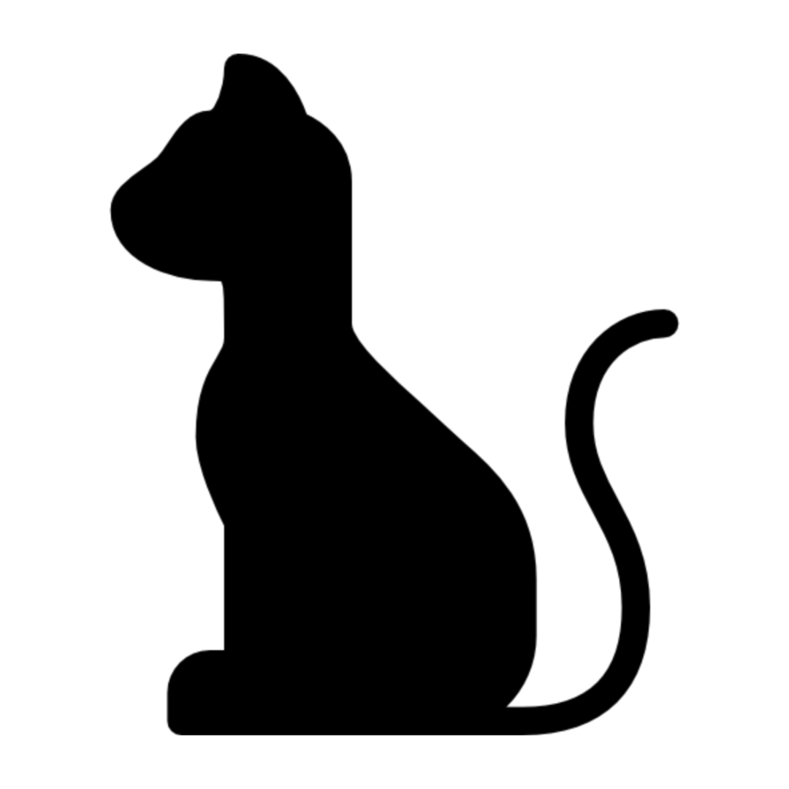

# 와피 - WAP Official App

```
WAP 행사일정을 쉽게 알려드릴게요! 함께해요 와피
```

<p align="center">
	    
</p>

### 기능 소개

#### 공지사항

- WAP 정규 활동 및 행사를 달력과 목록을 통해 확인할 수 있어요.
- 지정된 행사 날짜에 푸시 알림을 통해 리마인드 해드려요.

#### 출석

- 행사마다 출석을 체크할 수 있어요.
- 히스토리를 통해 출결상황을 체크할 수 있어요.

#### 설문

- 행사마다 설문 및 피드백을 작성할 수 있어요
- 설문과 피드백을 통해, 더 좋은 행사로 발전할 수 있어요.

#### 운영진
- 회원들의 설문을 확인할 수 있어요.
- 새로 공지사항을 등록할 수 있어요.

<br>

## 🍎 Contributors 🍌
[팀원 소개](https://www.notion.so/78595ac1f63c4b388c769319fa992db9)
<table>
  <tr>
    <td align="center"><a href="http://github.com/jeongjaino"><br /><sub><b>JinHo Jeong</sub></a><br /><a href="https://github.com/pknu-wap/WAPP/commits/main?author=jeongjaino" title="Code">💻</a></td>
    <td align="center"><a href="https://github.com/tgyuuAn"><br /><sub><b>Tgyuu An</b></sub></a><br /><a href="https://github.com/pknu-wap/WAPP/commits/main?author=tgyuuAn" title="Code">💻</a></td>
  </tr>
    <tr>
    <td align="center">안드로이드</td>
    <td align="center">안드로이드</td>
  </tr>
  <tr>
    <td align="center"><code>로그인</code>, <code>운영진페이지</code>, <code>마이페이지</code></td>
    <td align="center"><code>공지사항</code>, <code>달력</code>, <code>설문조사</code></td>
  </tr>
</table>
<br>

## 💻 Code Convention

[WAPP 안드로이드 코드 컨벤션](https://github.com/pknu-wap/WAPP/wiki/%F0%9F%A6%92%EC%95%88%EB%93%9C%EB%A1%9C%EC%9D%B4%EB%93%9C-%EC%BB%A8%EB%B2%A4%EC%85%98%F0%9F%A6%92)

<br>

## ⛓️ Git Convention & Git Flow 전략
[WAPP 깃 컨벤션](https://github.com/pknu-wap/WAPP/wiki/%F0%9F%90%B1%EA%B9%83-%EC%BB%A8%EB%B2%A4%EC%85%98%F0%9F%90%B1)
``` kotlin
1. Issue를 생성한다.
2. feature Branch를 생성한다.
3. Add - Commit - Push - Pull Request 의 과정을 거친다.
4. Pull Request가 작성되면 작성자 이외의 다른 팀원이 Code Review를 한다.
5. Code Review가 완료되면 Pull Request 작성자가 develop Branch로 merge 한다.
6. merge된 작업이 있을 경우, 다른 브랜치에서 작업을 진행 중이던 개발자는 본인의 브랜치로 merge된 작업을 Pull 받아온다.
7. 종료된 Issue와 Pull Request의 Label과 Project를 관리한다.
```
<br>

## 🚀 Trouble Shooting 
```
프로젝트 중 발생한 이슈에 대해 트러블 슈팅을 기록하는 공간입니다.
```
[WAPP 트러블 슈팅](https://discovered-trust-803.notion.site/WAPP-238f82deeac44721a3321665573c9f76?pvs=4)

<br>

## 🏃‍♂️ Sprint 
```
매주 수요일, 스프린트에 할당할 이슈를 지라와 깃헙에 등록한다. 스프린트 단위는 일주일이며, 개발 일정을 따른다.
목요일 오후 11시 30분까지 못 끝낸 이슈 하나당 스택 하나로 간주하며, 스택 세 개가 모였을 때 밥 한 끼를 사야 한다.
```
[스프린트 기록](https://www.notion.so/79134caa75394435a221a15c53226726?v=c3640a0dae5f4bac8ecf51d61aae4acf)

<br>

## 🎨 UI/UX


[UI/UX 보러가기](https://www.figma.com/file/ldfJcNruLXpb7e41P7LK3O/WAPP?type=design&node-id=0%3A1&mode=design&t=Q2vI9pGnu1OcsFWP-1)

<br>

## 🏗️ 모듈 의존성 그래프


